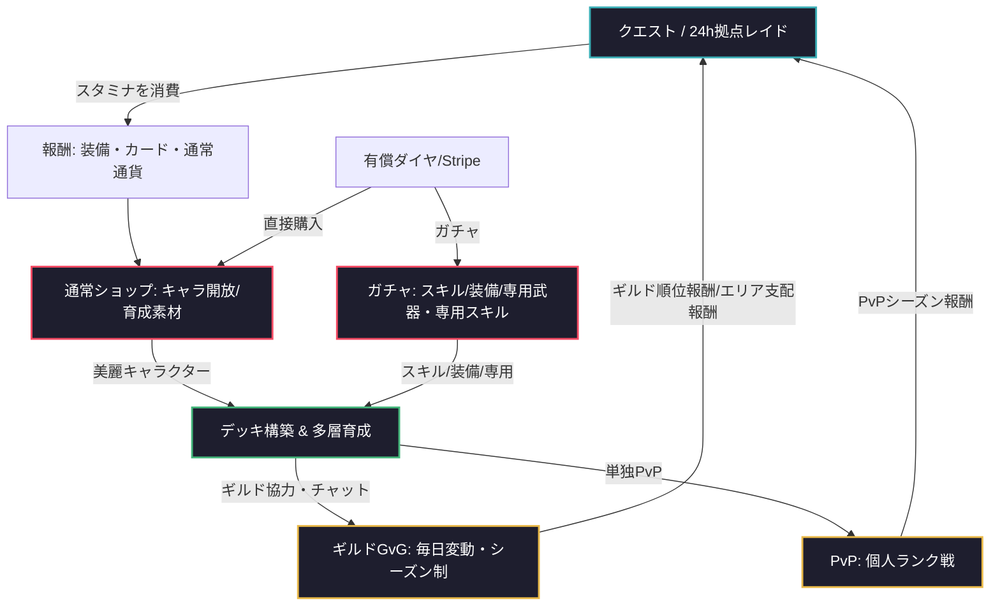

# ゲーム企画案：TRIBE: NEON REIGN

現代東京の夜の歓楽街を舞台に、厳選された美麗キャラクターにスキルカードや装備を組み合わせて戦う、ブラウザ向け非同期対戦＆協力レイド・カードバトルRPG。

---

## 1. ゲーム概要

| 項目 | 内容 |
| :--- | :--- |
| **タイトル** | TRIBE: NEON REIGN (トライブ：ネオン・レイン) |
| **ジャンル** | ギルドGvG・協力レイド型デッキ構築カードバトルRPG |
| **プラットフォーム** | PC/スマートフォン ブラウザ (レスポンシブ対応) |
| **ターゲット層** | 現代東京のアンダーグラウンド（ネオン街、裏社会抗争）の世界観を好む層、戦略的カードバトル愛好家、ギルド戦・レイド協力愛好家、やり込みハクスラ層 |
| **マネタイズ** | アイテム課金制（ガチャ：スキルカード・装備／直接販売：NPC開放、スタミナ回復薬、育成・覚醒素材）／決済：Stripe |

---

## 2. 世界観と勢力（テーマ：現代東京アンダーグラウンド）

現代の巨大都市「東京」。華やかな表の顔の裏側では、歓楽街の莫大な利権と覇権を巡って、ヤクザ、中国系マフィア、半グレ、スカウト組織などの「裏社会勢力」が血で血を洗う覇権抗争を繰り広げている。
プレイヤーは新興組織のリーダーとして、混沌とする首都圏の夜を支配すべく、仲間と共に抗争に身を投じる。

### 7つのエリアと裏社会組織

1. **池袋エリア：【風俗街 ＆ 中国系マフィア】**
   - **支配組織**：香港系『華興幇（ファンシンバン）』 ＋ 池袋北口風俗街組合
   - **特色**：池袋駅北口の風俗街のショバ代や闇スロット店、非合法マッサージ店の運営を資金源とし、暴力による強引な現状打破を厭わない中国系マフィア組織。
2. **新宿エリア：【スカウト ＆ ホスト ＆ ヤクザ】**
   - **支配組織**：スカウト会社『グレア・エージェンシー』 ＋ 指定暴力団『黒曜会』
   - **特色**：歌舞伎町を支配する高級スカウトグループとカリスマホストたち、および彼らのバックに潜む伝統的ヤクザ『黒曜会』の利権シンジケート。
3. **秋葉原エリア：【違法物品 ＆ コンカフェ ＆ 情報売買】**
   - **支配組織**：裏情報屋グループ『グリッド』 ＆ コンカフェ傘下グループ
   - **特色**：コンカフェの接客を通じて顧客に恋をさせ、弱みや機密情報を聞き出して売買する裏情報屋。および、違法な盗聴器やスタンガンなどのジャンク密売ネットワーク。
4. **渋谷エリア：【ドラッグ ＆ クラブカルチャー】**
   - **支配組織**：『渋谷ノイズ・ディストリビューション』
   - **特色**：渋谷のアンダーグラウンドなクラブシーンに深く根を張り、イベントやDJを隠れ蓑にして若者に合成ドラッグやコカインを流通させる売人ネットワーク。
5. **六本木エリア：【キャバクラ ＆ 違法IT長者】**
   - **支配組織**：投資グループ『ヴェルヴェット・キャピタル』
   - **特色**：高級キャバクラチェーンを経営し、裏では違法オンラインカジノや地下バカラの運営、および暗号資産を駆使した国際マネーロンダリングを仕切る新興IT犯罪グループ。
6. **川崎エリア：【地下格闘技 ＆ 新興ヤクザ ＆ ラッパー】**
   - **支配組織**：武闘派極道『川崎南部連合』 ＋ ストリートギャング
   - **特色**：臨海工業地区の廃倉庫で非合法なデスマッチ（格闘賭博）を主催する新興ヤクザ。地元の過激なラッパーたちがその凶暴性をブランディングしている。
7. **横浜エリア：【香港マフィア ＆ 密輸シンジケート】**
   - **支配組織**：香港系三合会『龍頭会（りゅうずかい）』
   - **特色**：横浜中華街の地下に拠点を置き、横浜港のコンテナ密輸ルートを何世代にもわたり完全掌握する、老舗の冷酷な国際マフィア。

---

## 3. コアゲームサイクル

本作のメインサイクルは、**「スタミナを消費してクエスト・ボス討伐」→「ギルドでの協力（レイド/GvG）」→「PvP個人ランキング」** です。仲間との強力なソーシャル要素と、多層的なやり込み（ハクスラ）要素が融合しています。

1. **行動力の消費（スタミナシステム）**
   - クエストや24時間レイドへの挑戦時にスタミナを消費。
   - シナリオエンジンを通じて、チュートリアルやキャラクター開放時のエピソードを再生。
2. **多層的な育成＆カスタマイズ**
   - キャラクター（40種程度）の開放と、専用限界突破アイテムによる「覚醒（最大+5）」。
   - スキルカードおよび装備品の「レベルアップ」と「限界突破（+値）」、およびレアリティ（N〜SSR）による特性強化。
   - 特定キャラのみが装備できる「専用装備」「専用スキル」のハクスラ・合成。
3. **ギルドGvG ＆ レイド**
   - **ギルドバトル（GvG）**: エリアの支配権（シノギの縄張り）を奪い合うギルド戦。支配度は毎日変動し、一定のシーズン制で競います。ギルドチャットで連携。
   - **非同期レイド**: 各エリアに24時間限定で出現する大ボスのHPをギルド/全プレイヤーで削り落とす協力コンテンツ。
4. **単独PvP (PvP)**
   - ギルドとは完全に独立した「個人対個人の非同期PvPランク戦」。

---

## 4. 主要ゲームシステム

### ① デッキによるスキルカードバトル
- **キャラクター特性（属性）**: 
  - 各キャラクターは「正義・悪・秩序・混沌」の4つの特性のいずれかが固定（可変しない）。
  - キャラクター自身が装備している得意スキルカードを使用すると、消費APが-1軽減（最低1）されるボーナスが発生。
- **専用装備・専用スキル**: 
  - 特定のキャラクターのみが装備できる超強力な「専用」スロットを実装。

### ② ギルドGvG（エリア争奪戦）
- 各エリアの支配ポイントを競うギルド対抗戦。
- 毎週の固定開催ではなく、**「毎日ポイントが変動」** し、一定期間の **「シーズン制」** で覇権を競います。
- クローズドな **「ギルドチャット」** で、メンバー同士が戦術的コミュニケーションを行います。

### ③ 非同期拠点レイド
- 7エリアそれぞれに大ボス（レイドボス）が順次出現。
- **24時間限定** でプレイヤー全体（ギルドメンバー）がバトルを挑み、ボスの膨大なHPを非同期で削る協力戦。
- 討伐報酬で専用装備や専用スキルの素材を獲得。

### ④ 単独PvP (個人PvP)
- ギルドバトルとは明確に切り離された、個人ランク（ブロンズ〜レジェンド）を競う非同期PvP。

### ⑤ シナリオエンジン
- チュートリアルやキャラクターの新規開放（アンロック）時、美麗な2Dセルルック静止画立ち絵と会話テキスト、BGMを組み合わせたアドベンチャーパートを再生し、世界観の深掘りを行います。

---

## 5. マネタイズ ＆ ゲーム内経済

Stripe決済を通じた課金通貨（ダイヤ）の購入と、それを利用した各種ガチャ・機能解放が中心となります。

- **ガチャシステム**:
  - **スキルカードガチャ** (通常〜専用スキルカード)
  - **装備品ガチャ** (通常〜専用武器・防具・アクセ、ハクスラ)
- **直接販売**:
  - **NPCキャラクターショップ** (ダイヤ/キャッシュによる開放)
  - **限界突破・育成時短パック** (キャラクター覚醒コア、装備強化石、スタミナ回復薬)

---

## 6. 技術要件 (code:wirth-dawn踏襲)

前作『code:wirth-dawn』の Next.js / Supabase / Stripe 構成をベースに拡張します。

- **シナリオエンジン**: wirth-dawn に実装されていたシナリオデータ構造 (`flow_nodes` による会話フロー) を再利用して開発。
- **ギルドチャット**: Supabase のリアルタイム通信機能（Realtime Channels）を活用し、即時反映のギルドチャットを構築。
- **Stripe**: 都度購入およびパッケージ取引の webhook 処理を応用。
