# ゲーム全体仕様書：TRIBE: NEON REIGN

本仕様書は、既存タイトル `code:wirth-dawn` の技術・機能アセットをベースに、ギルド、レイド、GvG（毎日変動・シーズン制）、単独PvP、固定属性、専用装備・専用スキル、およびシナリオエンジンを統合した『TRIBE: NEON REIGN』の全体設計図です。

---

## 1. データベーステーブル設計 (刷新＆拡張)

既存の構造をリセットし、ギルド、レイド、専用装備などを追加した新スキーマを定義します。

```mermaid
erDiagram
    USERS {
        uuid id PK
        string username
        int level
        int exp
        int neon_diamonds "有償通貨"
        int cash "通常通貨"
        int stamina "クエストスタミナ"
        int pvp_tickets "PvP行動力"
        timestamp last_stamina_recovery_at
        timestamp last_pvp_ticket_recovery_at
        uuid leader_character_id "お気に入りキャラ"
        uuid guild_id FK "所属ギルド"
        string title_equipped "装備中の称号"
        string equipped_background "装備中の背景"
        string equipped_front_effect "装備中の前面エフェクト"
    }

    GUILDS {
        uuid id PK
        string name
        string emblem_url
        string description
        string main_alignment "メイン属性"
        string sub_alignment "サブ属性"
        int level
        int exp
        timestamp created_at
    }

    GUILD_MEMBERS {
        uuid id PK
        uuid guild_id FK
        uuid user_id FK
        string role "leader/sub_leader/member"
        int weekly_contribution
        timestamp joined_at
    }
    
    BASES {
        uuid id PK
        string name "ネオンタワー、ディープドックなど"
        string description
        uuid current_controlling_guild_id FK "現在支配中のギルド"
    }

    GUILD_BASE_CONTROLS {
        uuid id PK
        uuid base_id FK
        uuid guild_id FK
        int control_points "毎日変動する支配P"
        timestamp updated_at
    }

    RAID_BOSSES {
        uuid id PK
        uuid base_id FK
        string name
        int level
        bigint max_hp
        bigint current_hp
        timestamp spawns_at
        timestamp expires_at "24時間制限"
        boolean is_defeated
    }

    CHARACTERS {
        uuid id PK "マスターID"
        string name
        string jp_name
        string title
        string img
        string home_town "地元"
        string alignment
        string growth_pattern_id FK
    }

    CHARACTER_GROWTH_PATTERNS {
        string pattern_id PK
        int base_hp
        int base_atk
        int base_def
        int base_spd
        int base_luk
        numeric hp_gain
        numeric atk_gain
        numeric def_gain
        numeric spd_gain
        numeric luk_gain
    }

    CHARACTER_AWAKENING_MASTER {
        int awakening_level PK
        int required_cash
        int hp_bonus
        int atk_bonus
        int def_bonus
        int spd_bonus
        int luk_bonus
    }

    ENEMIES {
        string id PK
        string name
        int level
        int hp
        int atk
        int def
        int spd
        int luk
        jsonb skills
        string enemy_type "PVP_DUMMY/GVG_NPC_DEFENSE"
    }

    USER_CHARACTERS {
        uuid id PK
        uuid user_id FK
        uuid character_id FK
        int level
        int awakening_level "覚醒レベル(上限5)"
    }

    USER_EQUIPMENTS {
        uuid id PK "個体ID"
        uuid user_id FK
        int item_id "アイテムマスターID"
        string rarity "N/R/SR/SSR"
        string slot "weapon/armor/accessory"
        int level
        int exp
        int plus_val "限界突破+値"
        jsonb random_options "ハクスラオプション"
        uuid equipped_character_id FK "装備対象キャラ"
        boolean is_exclusive "専用装備フラグ"
        uuid exclusive_character_id FK "専用NPC制限(NULLなら汎用)"
    }

    USER_SKILLS {
        uuid id PK
        uuid user_id FK
        int card_id "カードマスターID"
        string rarity "N/R/SR/SSR"
        int limit_break_plus "限界突破+値"
        uuid equipped_character_id FK "装備対象キャラ"
        int slot_index "装備スロット位置(0-5)"
        boolean is_exclusive "専用スキルフラグ"
        uuid exclusive_character_id FK "専用NPC制限"
    }

    BOARD_POSTS {
        uuid id PK
        uuid user_id FK
        string author_name
        string author_avatar_url
        string content "140字以内"
        string target_type "GLOBAL/GUILD"
        string target_id "guild_id (if GUILD)"
        boolean is_system
        timestamp created_at
    }

    BBS_THREADS {
        uuid id PK
        string category "RECRUIT/STRATEGY_CHAT"
        string title "50字以内"
        string content "200字以内"
        uuid user_id FK
        string author_name
        string author_avatar_url
        timestamp created_at
        timestamp updated_at
    }

    BBS_POSTS {
        uuid id PK
        uuid thread_id FK
        uuid user_id FK
        string author_name
        string author_avatar_url
        string content "200字以内"
        timestamp created_at
    }

    AVATAR_PARTS {
        string id PK
        string name
        string part_type "HAIR/FACE/BODY/SHOES/ACCESSORY/BACKGROUND_EFFECT"
        string image_path
        int price_cash
        int price_diamond
    }

    USER_AVATAR_PARTS {
        uuid user_id FK
        string part_id FK
        timestamp unlocked_at
    }

    USER_AVATARS {
        uuid user_id PK, FK
        string gender "MALE/FEMALE"
        string hair_id FK
        string face_id FK
        string body_id FK
        string shoes_id FK
        string accessory_id FK
        string bg_effect_1_id FK
        string bg_effect_2_id FK
        timestamp updated_at
    }

    CHARACTER_GROWTH_PATTERNS ||--o{ CHARACTERS : scales
    USERS ||--o{ USER_CHARACTERS : owns
    USERS ||--o{ USER_EQUIPMENTS : owns
    USERS ||--o{ USER_SKILLS : owns
    USERS }|--|| GUILDS : belongs
    GUILDS ||--o{ GUILD_MEMBERS : manages
    CHARACTERS ||--o{ USER_CHARACTERS : template
    USER_CHARACTERS ||--o{ USER_EQUIPMENTS : equips
    USER_CHARACTERS ||--o{ USER_SKILLS : equips
    BASES ||--o{ GUILD_BASE_CONTROLS : records
    BASES ||--o{ RAID_BOSSES : spawns
    USERS ||--o{ BOARD_POSTS : posts
    USERS ||--o{ BBS_THREADS : creates
    USERS ||--o{ BBS_POSTS : replies
    BBS_THREADS ||--o{ BBS_POSTS : has
    USERS ||--|| USER_AVATARS : configures
    USERS ||--o{ USER_AVATAR_PARTS : unlocks
    AVATAR_PARTS ||--o{ USER_AVATAR_PARTS : template
    AVATAR_PARTS ||--o{ USER_AVATARS : equipped
```

### テーブル移行対応表

| wirth-dawn テーブル | tribe-neon テーブル | 主な変更点 |
| :--- | :--- | :--- |
| `user_profiles` | **`users`** | `gold` → `cash`、有償通貨 `neon_diamonds` 追加、ギルド関連FK追加。アバター機能は裏で実装しつつも現在は一時オミット中であり、マイページではお気に入りNPC画像と拠点連動背景を使用する。 |
| (新規) | **`avatar_parts`** **`user_avatar_parts`** **`user_avatars`** | **新規追加（一時オミット中）**：アバターパーツのマスタ管理、ユーザーの所持状況、現在の装着状態（性別、表情、髪型、服装、靴、アクセ、背景エフェクト2スロット）の管理。 |
| (新規) | **`guilds`** / **`guild_members`** | **新規追加**：ギルドの管理、所属メンバー、役割、貢献度の管理。メイン・サブのギルド属性（アライメント）追加。 |
| `locations` | **`bases`** | ネオンタワー、ディープドックなど4つの主要拠点。 |
| `world_states` | **`guild_base_controls`** | ギルド別の拠点支配度（毎日変動、シーズン制）を管理。 |
| (新規) | **`raid_bosses`** | **新規追加**：各拠点に出現する24時間制限の非同期レイドボスのHP同期用。 |
| `npcs` / `party_members` | **`characters`** (マスター) **`user_characters`** (個別) **`character_growth_patterns`** (新規) **`character_awakening_master`** (新規) **`enemies`** (新規) | 雇用・ストーリー進行によるアンロックの廃止。キャラクターはガチャ獲得に移行し、初期60名以上を静的実装。ステータス成長および覚醒ボーナス・コストは、新設された成長パターンマスタと覚醒マスタテーブルに完全マスタ化。PvPダミーおよび公式NPC防衛チームデータもエネミーマスタに一本化。 |
| (新規) | **`user_equipments`** | **新規追加**：ハクスラ用ユニーク装備。レアリティ(N〜SSR)、合成Lv、限界突破+値、専用制限(`exclusive_character_id`)を追加。 |
| `user_skills` | **`user_skills`** | スキルのレアリティ、限界突破+値（％表記）、装備対象キャラ、専用制限を追加。 |
| `gossip_posts` | **`board_posts`** | 掲示板（チャット）。`target_type` から `area`, `showcase` を廃止し、`global`（全体）と `guild`（ギルド）に制限。 |
| (新規) | **`bbs_threads`** **`bbs_posts`** | **新規追加（スレッド式BBS）**：スレッド単位の掲示板システム。ギルドメンバー募集 (Recruit) および 攻略＆雑談 (Strategy Chat) カテゴリ。レス投稿時にスレッドの updated_at を自動更新するトリガー付き。 |
| `scenarios` | **`quests`** | 放置派遣（遠征）用のコースデータ（初級、中級、上級）を定義するマスターデータ。 |
| (新規) | **`user_expeditions`** | **新規追加**：ユーザーの派遣状態（キャラクターロック、帰還予定、経過ログ＆報酬）を管理。 |

---

## 2. 画面構成・レイアウト設計 (UI/UX)

1. **マイページ (Home / 拠点トップ)**
   - **リーダーキャラクター立ち絵と拠点背景ビジュアル（アバター一時オミット中）**:
     - ビジュアルエリアの背景には、現在滞在している拠点（新宿など）に応じた拠点背景画像が表示されます。その上には、お気に入りリーダーキャラクター（NPC立ち絵）が大きく表示されます（ちびキャラアバターの表示と固定背景は一時オミットされています）。
     - ※ただし、将来アバター機能が有効化された際は、アバター用固定背景の上にレイヤードアバター（背景エフェクト、素体、表情、服装、靴、髪型、アクセ）を重ね合わせ描画する仕様へ切り替えが可能です。
     - 最上部には absolute オーバーレイ（絶対配置）で `拠点名 ｜ 支配: 支配プレイヤー名` HUD（デザイン背景 `hud_bg.png`）を配置し、そのすぐ右隣に同じフォントサイズ（8px相当）の「拠点移動」ボタン（デザイン背景 `move_btn_bg.png`）を横並びに配置。
     - レイド警告「⚠️強敵襲来中! (BOSS ALERT)」は、ヘッダーとビジュアルの間の独立したソリッドなバッジスペース（`mypage-raid-alert-banner`）を設けて中央寄せで明滅させ、アバターに絶対重ねないように配置。
   - **メイン大ボタンメニュー (横並び・隙間なし)**:
     - ホーム（Home）ボタンを削除し、大ボタンは5つ（Quest, PvP, Gacha, Character, Guild）で構成。
     - ビジュアルの上に重ねず、ビジュアルエリアとイベントティッカーの間の独立した行（`.mypage-horizontal-menu-row`）に配置します。
     - 各ボタンサイズを `62px` に拡大し、ボタン間の隙間（`gap`）を `0px` に設定し、中央寄せでピッタリと密着して横一列に並ぶアウトローゲーム調のデザインにします。HTML上の重ねテキストは削除し、画像内の英字デザイン文字のみで表示します。
   - **右上サブ小メニュー (透過SVG)**:
     - ミッション、プレゼント、設定の3連小ボタンは、背景ビジュアルの右上から縦に3つ並べる配置として上からミッション、プレゼント、設定の順に並べます。
     - ジャギーがなく最速でロードされる100%透過な「インラインSVG」を使用し、CSSで枠線、背景色、影をすべて完全透過にリセットした透過UI仕様にします。新規達成時の「！」マークは正常にバッジとして右上にオーバーレイします。
   - **チャットエリアのコンパクト化**:
     - 最下部常時表示チャットのヘッダーである「暗号アプリ『トライブ』」「オンライン：〇名」を1行に集約し、フォントサイズを `7px` に極小化します。
     - メッセージログの最大表示高（`maxHeight`）は `42px` に制限し、ウィジェット全体のパディングを詰めて高さを最小限に抑え、画面全体の高さの中にすべての要素が綺麗に収まるようにします。
2. **PvP画面 (PvpTab) [独立SPA化]**
   - 単独のビューコンポーネント `PvpTab.tsx` に完全分離。
   - 単独PvP戦、対戦相手リストの読み込み、日次/シーズン勝利履歴、防衛履歴、ランキング順位を一元管理します。
3. **GvG画面 (GvgTab) [独立SPA化]**
   - GvG縄張り戦（支配ベースリスト、侵攻攻撃、防衛配備など）を処理する単独のビューコンポーネント `GvgTab.tsx` に完全分離。
4. **レイド画面 (RaidTab) [独立SPA化]**
   - ボスの残り制限時間、ボス残りHPバー、総与ダメージ表示、挑戦ボタン、与ダメージランキングログ、管理者デバッグ用撃破/リセットボタンのすべてのUIとSupabase連携を処理する単独のビューコンポーネント `RaidTab.tsx` に完全分離。
5. **ギルド画面 (Guild)**
   - ギルドメンバーリスト、ギルドチャット（リアルタイム即時反映）。
   - GvG（拠点支配戦）のリアルタイムランキング・防衛デッキ配備。
   - ギルドマスターによるメイン・サブのアライメント属性（正義/悪/秩序/混沌）の設定変更コントロール。
4. **クエスト（派遣）画面 (Quest / シノギ)**
   - 派遣先（新宿〜横浜の7箇所）を選択後、コース（初・中・上級の全21コース）を選び、最大3名のキャラクターを編成してスタミナを消費し派遣（シノギ）を行います。
   - 地元（`homeTown`）と派遣先が一致するキャラクターの選択時には、LUK/地元一致ボーナス効果としてゴールドの枠線およびバッジを表示。
   - 派遣完了時のキャッシュおよびアイテム/装備品ドロップ報酬は、すべてプレゼントボックスへ UNCLAIMED 状態のプレゼントとしてインサートされます。
   - ダイヤまたはキャッシュを消費することで、即座に派遣を完了（帰還）させて報酬獲得可能です。
   - 派遣中のキャラクターには一時的な編成ロックがかかります（PvPやレイドは利用可能）。
5. **マップ画面 (Map)**
   - 現代東京のアングラ世界にそびえ立つ4つの主要拠点（ネオンタワー、ディープドックなど）を描いた鳥瞰イラストによる **「1枚の全体マップ（モバイル1画面サイズ）」**。
   - 各拠点をタップすると「支配ギルド名」「レイドボス出現状況」「占領ポイント数」を表示し、ワンタップで即座に移動が完了。所属拠点の概念はなく、移動は自由です。
6. **バトル画面 (Battle)**
   - 5人編成による完全オート進行・個別HP管理のリアルタイムRPG風バトル画面（通常/レイド/PvP/GvG共用）。
   - バトル開始前の `SETUP`（準備）フェーズで敵情報の確認、自部隊5人の装備・スキルの詳細閲覧、作戦の選択（6パターン）を行い、「抗争開始」によりバトルスタート。
   - バトル中（`PLAYING`）は作戦変更不可の完全オート進行で、タイムライン順のスキル自動発動、可変最大AP消費、ターゲットレーザーラインや発動カットイン、被弾振動、個別HPメーター直上ポップアップなどの演出を経て結果まで見届けます。
   - PvP戦およびGvG防衛戦において、防衛側キャラクターの属性と相手ギルドのアライメント属性が一致する場合、防衛ボーナス（メイン一致でパラメータ+20%、サブ一致で+10%）が自動適用されます。
7. **キャラクター画面 (CharacterTab)**
   - **画面構成**: 
     - **上部**: 中央に「5層レイヤー重ね合わせキャンバス」、その左右両脇を挟む形で「7スロットの装備枠」を配置（左列：武器1, 武器2, 頭防具 ｜ 右列：胴防具, 脚防具, アクセ1, アクセ2）。
     - **左右矢印 ◀ / ▶ とページャー**: 立ち絵左右の矢印ボタンで、アンロック済みのキャラクターを「レイジ (1 / 5)」のように順次切り替え可能。
     - **5層レイヤー構造**:
       1. [Z-10] 最背面レイヤー：背景（選択された背景画像、未設定時は滞在拠点背景）
       2. [Z-20] 背後エフェクトレイヤー：足元オーラ、陣など（キャラクターの覚醒ランクに応じて、無覚醒=なし、覚醒1〜4=小オーラ、覚醒MAX(5)=大オーラを自動でCSSアニメーション再生）
       3. [Z-30] キャラクターレイヤー：メイン透過立ち絵（`_transparent_asset.png`）を Bottom/Center 基準で描画
       4. [Z-40] 前面エフェクトレイヤー：前面の稲妻、火の粉、煙など（プロフィールから設定されたCSSパーティクル・フィルターアニメーション）
       5. [Z-50] 最前面UIレイヤー：装備された通り名・称号名フレームUI
     - **下部詳細パネル**: 
       - `ステータス・育成`：レベルアップ、覚醒限界突破（抗争の掟・指南書・キャッシュ消費）、ステータスグリッド。
       - `スキルデッキ`：6枚のスキル装備スロット。キャラクターIDと一致する「得意スキル」装備時は消費AP-1軽減のシナジー情報をバッジ表示。
       - `装備詳細`：左右の装備スロットがタップされた際、自動でこの詳細ビューがアクティブになり、レベルアップ/限界突破ボタンを表示します。
   - **描画負荷削減（サムネイルキャッシュ）**: 
     - キャラクター詳細表示画面では上記の5層レイヤーアニメーションを描画しますが、GvG一覧、ランキング、PCサイドバーなどのリスト・アイコン表示時は、合成済みの静止画像キャッシュ（`_final_asset.png`）を1つの `` で描画し、読み込みと描画の負荷を徹底的に軽減します。
   - **装備レベルスケーリング**: 
     - `ATK/DEF/HP` は装備レベルおよび限界突破値により上昇、`SPD/LUK` はベース値のままフラット。
8. **設定画面 (Settings)**
   - お気に入りNPC（リーダー）設定、通り名（称号）変更、音量調整、アカウント管理。
9. **ガチャ & ショップ (Store / Gacha)**
   - Stripe決済によるダイヤ・パッケージ購入確認および完了画面。スキル/装備ガチャ、NPCアンロック直接販売。
10. **ミッション画面 (Mission)**
    - デイリー・通常の2タブ表示。クリア済みのミッションを一括/個別で回収。
11. **プレゼントボックス画面 (Present Box)**
    - 運営配布、クエスト報酬、みかじめ料などのアイテムを一時プールし受け取る画面。受け取りと同時に `user_items` や `user_equipments` などのテーブルへ安全にインサートされます。

### 2.5 アプリケーション・アーキテクチャ設計 (コード構成)

ファイル肥大化を防ぎ、保守性を高めるため、フロントエンドは関心の分離に基づき再構築されています。

1. **React Context (`GameContext.tsx`)**:
   - アプリケーション全体のグローバル状態定義、Supabase DB実データとの同期サイクル、放置派遣タイマー、およびWeb Audio APIを用いた Cyber BGM・SE 再生機能などのインフラ的処理を一元管理します。
2. **バトル進行フック (`useBattle.ts`)**:
   - 完全オートバトルにおける複雑な状態遷移、NPC作戦AI、装備スキルのAP軽減・得意シナジー判定、個別HPおよび共有可変APの処理、および被ダメージ時・回復時のアニメーション演出制御をカプセル化して提供する独立カスタムフックです。
3. **計算関数 (`stats_calculator.ts`)**:
   - キャラクターのステータス計算（限界突破やレベル補正のスケーリング）を独立した純粋関数モジュールに集約。
4. **コンポーネント指向 Vanilla CSS**:
   - すべての画面要素は `src/app/components/` に配置され、対応する Vanilla CSS ファイル（例: `Header.css`）が同一階層にペアで配置されて直接インポートされる構造を採用しています。

---

## 3. コアシステム詳細仕様

### ① 属性固定とバトルボーナス
- キャラクターの特性（正義、悪、秩序、混沌）はマスターデータで固定。
- 得意スキルボーナス：装備スキルが得意スキル（キャラクターIDが一致）の場合、自動発動時の消費APが -1 軽減（最低消費AP 1）。威力の上昇補正やバフ持続ターン延長はありません。
- **専用装備・専用スキル**: 該当NPCが装備した時のみ、超強力な固有パッシブが発動。他キャラは装備不可。
- **ギルド属性防衛ボーナス**: 防衛側デッキのキャラクターの属性がギルドのメインアライメント属性と一致する場合にパラメータ（HP/ATK/DEF）+20%、サブアライメントと一致する場合に+10%が適用。

### ② ギルドバトル（GvG：拠点縄張り争奪戦）
- プレイヤーがGvGで他ギルドの防衛デッキを撃破すると、その拠点の「ギルド支配ポイント」が増加。
- **ダブルランキングシステム**:
   - **デイリー**: 毎日深夜24:00に日次獲得ポイントを集計。拠点ごとのデイリー1位ギルドが、翌日の拠点支配権（ログインみかじめ料）を獲得。
   - **制圧みかじめ料**: 1拠点支配につき毎日10,000キャッシュが、ログイン時にプレゼントボックス経由で自動送付されます。
   - **シーズン**: 1シーズンの累計拠点支配日数でギルド総合順位を競い、豪華最終報酬（ダイヤ等）をプレゼントボックス経由で配布。

### ③ 24時間拠点レイドボス
- 各拠点に不定期に出現。出現から **24時間** カウントダウンが開始。全プレイヤーで非同期にボスのHPを削る協力戦。
- **ダブルランキングシステム**:
   - **デイリー (1ボス毎)**: 24時間の討伐終了時、個人およびギルドの「ボスへの総与ダメージ」を集計。上位に専用装備のレア素材を配布。
   - **シーズン**: レイドシーズンを通じた「総討伐数」および「累積与ダメージの総和」で総合順位を競います。

### ④ シナリオエンジン (Adventure System)
- `wirth-dawn` の `scenarios.flow_nodes` 形式（JSONBによるノード進行）を踏襲。
- 背景画像、立ち絵スプライト、BGM・効果音、テキスト表示、選択肢による分岐をクライアントで動的にレンダリングする軽量ADVエンジンを実装します。

### ⑤ 初期アセット実装数 ＆ アップデート方針
初期リリース時の開発スコープおよびリリース後の運用追加アセットの配分は以下の通りマスタデータ管理されます。N〜SSRの配分はマスタ管理により出現率傾斜（確率設定）をかけて制御します。

- **キャラクター (NPC)**: 総数 40種程度 / 初期ローンチ時 **20種** 実装（残りの20種はリリース後のアップデート運用に回します）
- **スキルカード**: 総数 100種 / 初期ローンチ時 **40種** をガチャに投入（残りの60種は30種×2回に分けてカードパックガチャ販売としてアップデート追加）
- **装備品アセット**:
  - **武器**: 総数 40種 / 初期 **30種**（残10種はアップデートストック）
  - **頭防具**: 総数 30種 / 初期 **20種**（残10種はアップデートストック）
  - **身体防具**: 総数 30種 / 初期 **20種**（残10種はアップデートストック）
  - **脚防具**: 総数 30種 / 初期 **20種**（残10種はアップデートストック）
  - **アクセサリー**: 総数 40種 / 初期 **30種**（残10種はアップデートストック）

### ⑥ ログイン時のデータプリフェッチ ＆ ゼロレイテンシ同期
- ログイン時の初期ローディングの裏で、未読お知らせ見出し、プレゼント未受取リストを非同期プリフェッチ。
- 各画面へ遷移した際はクライアント側のキャッシュを0秒で即座に表示（SWRパターン）。画面ごとの「都度ローディング画面」を完全に排除し、操作レスポンスを向上。

### ⑦ ユーザーアバター着せ替え ＆ キャラクターメイキング仕様 (一時オミット中)
> [!NOTE]
> 本セクションに定義された仕様（UI画面、遷移導線）は現在一時オミットされています。ただし、将来アバター機能が有効化された際にすぐ動作するよう、バックグラウンドのデータ構造・同期ロジック・画像プリロード等はそのまま生かされています。

- **新規ユーザー組織設立 (SetupView) ※アバター設定は自動処理**:
  - ゲーム開始時のセットアップ画面では、アバターメイキングUIは表示されず、ユーザー名、初期メンバー、初期拠点の選択のみで開始します。
  - 裏側では、デフォルトのアバター値（男、初期ツンツン髪、初期通常表情）が自動的に登録され、データ構造の整合性を維持します。
- **アバター着せ替え画面 (AvatarTab) ※通常非表示**:
  - プレイヤーが所持しているアバターパーツ（髪型・表情各男女8種、服装1種、アクセ、背景エフェクトなど）を着せ替えたり購入したりする画面です。現在はメニュー一覧からのボタン導線がコメントアウトされています。
- **ロード時間短縮 ＆ UX保護対策**:
  - **WebP形式の採用**: レイヤード表示する各パーツ画像は、透過状態を保ちつつ軽量な `WebP` 形式で用意し、通信データ量を最小化します。
  - **ログイン時プリフェッチ**: ログインローディング時に、装着中のアバターパーツ画像をバックグラウンドで事前ロード（プリフェッチ）し、画面遷移後の瞬時表示を可能にします。
  - **全パーツ読込同期**: レンダラー側で全装着パーツ画像のロード完了（`onLoad`）を検知するまでプレースホルダー（影絵やスピナー）を表示し、一瞬パーツが欠けたアバターが表示される現象（ちらつき）を防ぎます。
  - **ブラウザキャッシュ設定**: アセットのキャッシュ期間を長期に設定し、2回目以降のアクセス時にはローカルキャッシュからロードされるようにします。

### ⑧ PvPシステム詳細仕様 (マッチング・報酬・経験値・作戦AI)
- **マッチング抽出ロジック**:
  - 対戦相手候補は、自分の現在のレート（ランクポイント）から **プラスマイナス100の範囲** に位置する他プレイヤーから最大5人をランダム抽出します。
  - レート範囲内に適合する他プレイヤーデータが5人未満である場合は、不足している人数分をダミーNPC（ギルド「新宿南部連合」所属のリュウ、カイなど）で自動補填し、常に5名の対戦相手候補を表示します。
  - 対戦相手候補を最新情報に手動で更新できる「🔄 対戦相手更新」ボタンを画面上に設けます。
- **レート差による獲得報酬スケーリング**:
  - 撃破した対戦相手とのレート差（`diff = 相手レート - 自分レート`）に応じて、獲得するポイント（レート）およびキャッシュがスケーリング変動します。
  - **勝利時**:
    - **PvPポイント**: `15 + Math.floor(diff / 50)` (下限 +5 pt / 上限 +30 pt)
    - **キャッシュ**: `400 + Math.floor(diff * 1.5)` (下限 100 Cash / 上限 1000 Cash)
    - **ユーザー経験値（XP）**: 固定で **150 xp** を獲得（直接加算、プレゼントボックスは経由しません）
  - **敗北時**:
    - **PvPポイント**: `-5 + Math.floor(diff / 50)` (下限 -15 pt / 上限 -2 pt)
    - **キャッシュ**: **一律 0 Cash**
- **ランキング報酬のマスタ管理**:
  - PvP報酬マスタ `pvp_rewards_master` テーブルによって報酬を管理します。
  - 1週間サイクルのシーズン終了時、プレイヤーの到達レート（`threshold_points`）に応じたランク報酬（ダイヤ等）が自動的に抽出され、プレゼントボックスへ送付されます。
- **防衛デッキの作戦設定および戦闘AI**:
  - 防衛デッキ（`pvp_defense_decks`）のメンバーを登録する際、防衛時AIに適用する「作戦（`tactic`）」を以下の6つのいずれかから選択して保存できます。
    - `OFFENSIVE` (攻撃重視：高威力スキルを優先使用)
    - `DEFENSIVE` (防御重視：自身へのシールド・防御を優先)
    - `HEALING` (回復重視：HPが低下した仲間を優先回復)
    - `BALANCED` (バランス：HP50%以下なら回復、他は攻撃)
    - `AP_CONSERVING` (AP温存：APを極力消費せずに溜める)
    - `TACTICAL` (特殊戦術：バフ・デバフによる支援を優先)
  - PvP戦闘において、敵プレイヤーの防衛デッキと対戦する際、敵AI（`useBattle.ts` 内の `executeEnemyTurn`）は保存された防衛作戦に基づいて行動選択およびターゲット決定を行います。
- **ロード時間短縮（SWR ＆ プリロード）**:
  - PvP画面への遷移時は、前回の取得対戦相手リスト（キャッシュ）を **0秒で即座に表示（SWRパターン）** し、裏で非同期に最新リストへ更新します。
  - 対戦相手リストがロードされた段階で、各相手のリーダー立ち絵やアイコンなどの画像アセットをバックグラウンドでプリロードし、戦闘開始時のロード遅延を防ぎます。
  - 非同期処理待ちのローディングインジケータはシンプルな円環スピナーのみを表示し、「Now Loading...」などの文字ラベルの併記・表示は一切禁止します。
- **PvPランキング遷移**:
  - PvP画面の「🏆 PvPランキング」ボタンから、ランキング画面の「PvP」カテゴリ（`RankingTab` の指定サブタブ）へ直接遷移させることができます。

